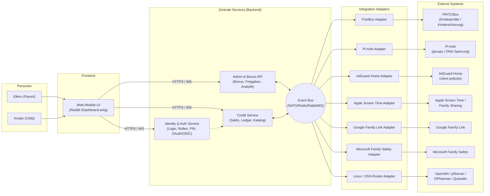
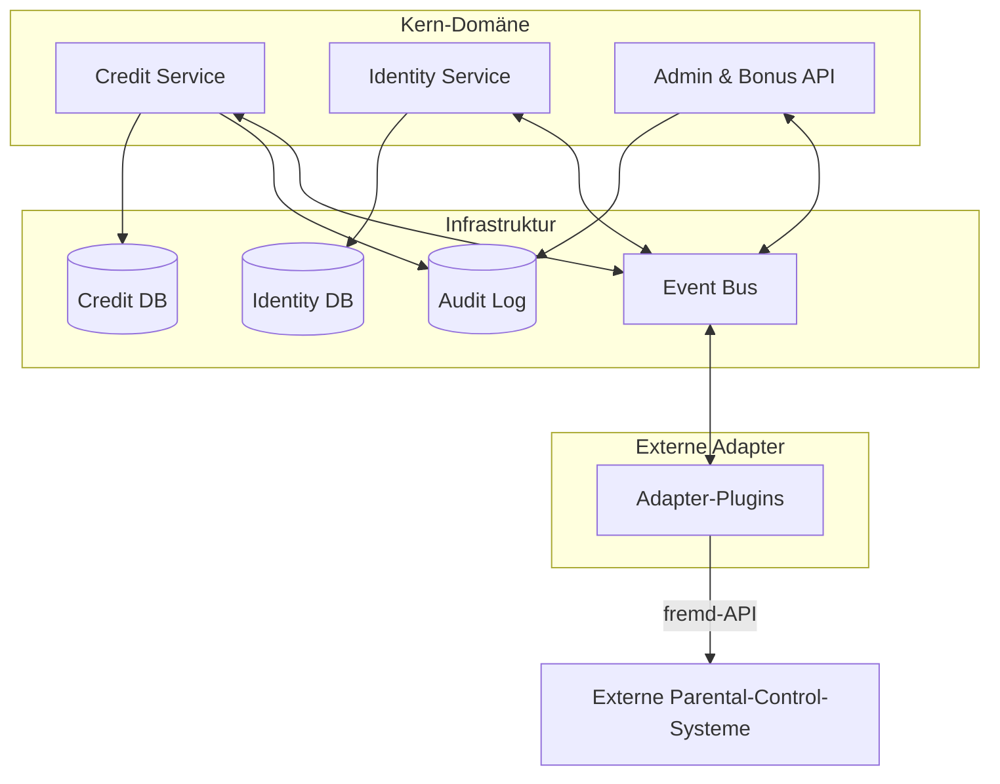
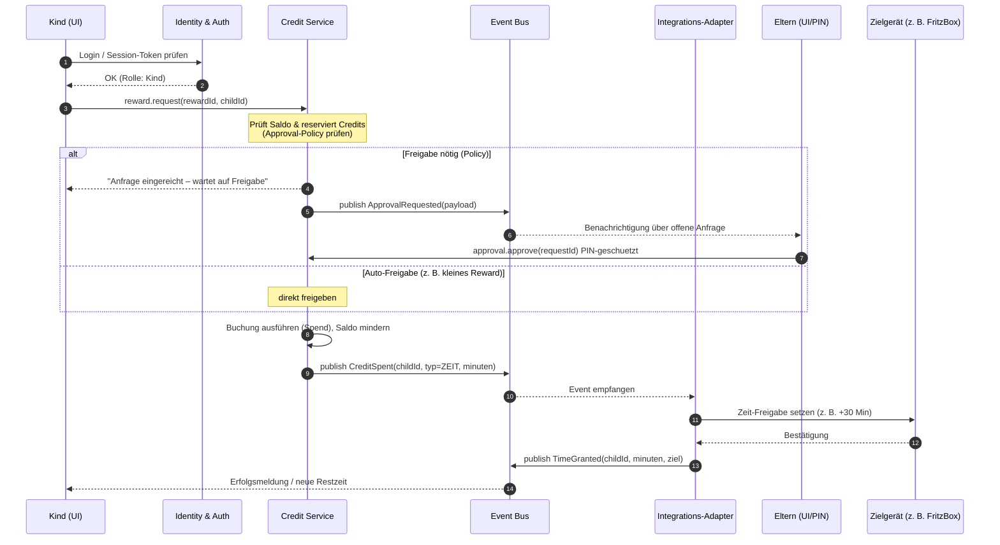
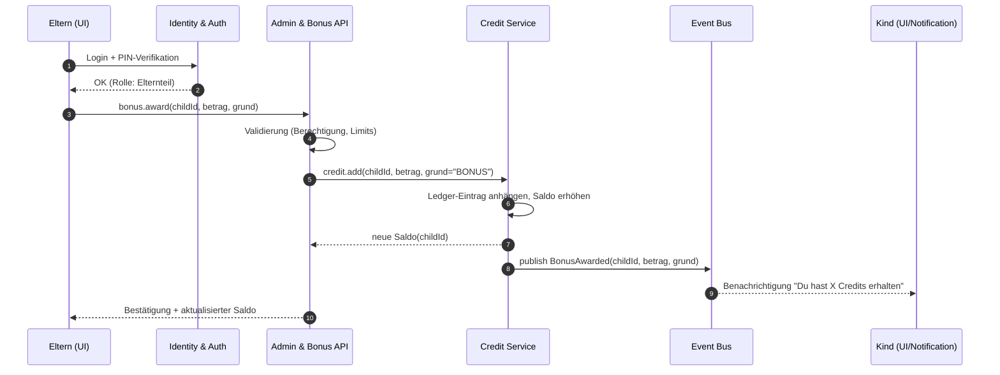

# Design: Screen-Time- & Credit-Management-Integration

> Status: **Entwurf (Draft)** · Version 0.1 · Sprache: Deutsch
> Autoren: Projektteam · Lizenz: siehe Repository

Dieses Dokument beschreibt die Architektur und die Integrationsmöglichkeiten
eines offenen Systems zur Verwaltung von **Bildschirmzeit (Screen Time)** und
einem **generischen Credit-/Token-System** für Familien. Es vergleicht
architektonische Varianten (Monolith vs. Microservices) und gibt eine
Empfehlung. Das Dokument ist bewusst technologieoffen gehalten und dient als
Grundlage für weitere Konzeption und Implementierung.

---

## Inhaltsverzeichnis

1. [Zielsetzung und Vision](#1-zielsetzung-und-vision)
2. [Begriffe (Glossar)](#2-begriffe-glossar)
3. [Generisches Credit-/Token-System](#3-generisches-credittoken-system)
4. [Architekturübersicht (Microservices)](#4-architekturuebersicht-microservices)
5. [Mermaid-Architekturdiagramm (C4)](#5-mermaid-architekturdiagramm-c4)
6. [Sequenzdiagramm: Zeit gegen Credit eintauschen](#6-sequenzdiagramm-zeit-gegen-credit-eintauschen)
7. [Sequenzdiagramm: Bonus vergeben](#7-sequenzdiagramm-bonus-vergeben)
8. [Integrationsmatrix](#8-integrationsmatrix)
9. [Detailbetrachtung der Integrationen](#9-detailbetrachtung-der-integrationen)
10. [Monolith vs. Microservices](#10-monolith-vs-microservices)
11. [Empfohlene Architekturvariante](#11-empfohlene-architekturvariante)
12. [Nächste Schritte & offene Punkte](#12-naechste-schritte--offene-punkte)

---

## 1. Zielsetzung und Vision

### Vision

Eltern möchten die Bildschirmzeit ihrer Kinder nicht nur *begrenzen*, sondern
sie mit positiven Verhaltensweisen verknüpfen. Statt reiner Restriktion
("Du darfst nicht!") soll ein System Anreize schaffen ("Wenn du Aufgabe X
erfüllst, bekommst du Y Minuten Bildschirmzeit bzw. Credits, die du gegen
Belohnungen eintauschen kannst").

### Ziele

- **Ein zentrales Credit-/Token-System**, das herstellerunabhängig arbeitet.
- **Pluggable Integrationen** mit bestehenden Eltern-Kontroll-Lösungen
  (FritzBox, Pi-hole, AdGuard Home, Apple Screen Time, Google Family Link,
  Microsoft Family Safety, Linux-/Open-Source-Router-Lösungen).
- **Transparenz für Eltern und Kinder**: wer hat wann welche Zeit/Credits
  erhalten, ausgegeben oder gespart.
- **Eigenständigkeit**: Das System läuft idealerweise selbst gehostet
  (Self-Hosting) und benötigt keine Cloud-Anbindung, falls die Familie dies
  wünscht. Optional kann eine Cloud-/Mobile-App ergänzt werden.
- **Offenheit**: klare APIs (REST/WebSocket/Events), sodass neue
  Integrationsadapter ohne Kernänderungen hinzugefügt werden können.

### Inspirationsquellen

Dieses Konzept baut auf zwei bestehenden Projekten auf und erweitert diese zu
einem integrierbaren Backend:

| Projekt | Kernidee | Übernommen in dieses Design |
|---------|----------|------------------------------|
| **BlessedCow/TokenEconomy** | Token-/Münz-Wirtschaft (Coin Economy) in Google Sheets; Kinder verdienen Coins durch positives Verhalten und lösen diese gegen Belohnungen ein (einfaches POS-System). | Das Modell des "Verdienstens" (Earning) und "EinlöSENS" (Redeeming), Katalog von Belohnungen, Guthabenverwaltung (Balance). |
| **thim81/kids-screen-time** | Web-App zur Verfolgung von Bildschirmzeit mit Echtzeit-Counter, Belohnungs-Presets, Warteschlange für Freigaben (Pending Reward Queue) und Eltern-PIN. | Echtzeit-Tracking, Belohnungs-Freigabefluss (Approval), Historie/Analytik, PIN-Schutz. |

Das Ziel ist, die *Geschäftslogik* beider Ansätze (Credit-Verwaltung +
Zeit-Tracking/-Freigabe) in ein **zentrales, integrierbares System** zu
überführen und über Adapter an bestehende Geräte- und Netzwerk-Steuerungen
anzubinden.

### Abgrenzung (Non-Goals)

- Keine vollständige Neuimplementierung eines Parental-Control-Tools je
  Plattform – stattdessen Integration in bestehende.
- Keine Tiefen-Analyse des Geräteverhaltens der Kinder (Inhaltsscan etc.).
- Keine kommerzielle Vermarktung im ersten Schritt.

---

## 2. Begriffe (Glossar)

| Begriff | Englisch | Definition |
|---------|----------|------------|
| **Bildschirmzeit** | Screen Time | Die Zeitspanne, in der ein Kind ein digitales Gerät (Tablet, Handy, TV, Konsole) nutzt. Wird hier primär in Minuten gemessen. |
| **Credit** | Credit | Die interne Währungseinheit des Systems. Credits können Bildschirmzeit-Minuten entsprechen oder allgemeiner als Belohnungspunkte dienen (1 Credit ≙ konfigurierbare Minuten). |
| **Token** | Token | Synonym zu Credit verwendet, vor allem im Kontext von Token-Economy-Ansätzen (vgl. BlessedCow/TokenEconomy). Im technischen Kontext auch: Authentifizierungs-Token (hier explizit unterschieden). |
| **Bonus** | Bonus | Eine zusätzliche Gutschrift, die ein Elternteil einem Kind frei vergeben kann (z. B. für erledigte Aufgaben, gutes Verhalten, Geburtstag). Erhöht den Credit-Saldo. |
| **Belohnung / Reward** | Reward | Ein einlösbarer Artikel oder eine Dienstleistung aus dem Katalog (z. B. "30 Minuten Konsole", "Auswahl des Abendessens"). Hat einen Credit-Preis. |
| **Mikroservice** | Microservice | Ein in sich abgeschlossener Dienst mit eigener Verantwortung und klarer API, der unabhängig entwickelt, skaliert und ausgerollt werden kann. |
| **Identität** | Identity | Die Verwaltung von Benutzerkonten (Kinder, Eltern, Admin) samt Rollen und Authentifizierung. |
| **Freigabe (Approval)** | Approval | Der Vorgang, bei dem ein Elternteil eine vom Kind gestellte Anfrage (z. B. Belohnung oder Extra-Zeit) bestätigt oder ablehnt. |
| **Adapter** | Adapter / Connector | Ein Integrationsmodul, das das zentrale System mit einem externen System (FritzBox, Pi-hole, Apple Screen Time etc.) verbindet. |
| **Event Bus** | Event Bus | Ein asynchroner Nachrichtenkanal (Message Broker), über den Services Ereignisse veröffentlichen und abonnieren. |

---

## 3. Generisches Credit-/Token-System

Das Kernstück des Systems ist eine **Währung namens Credit**, die das Bindeglied
zwischen *Verhalten/Aufgaben* und *Bildschirmzeit/Belohnungen* bildet. Dieses
Modell ist inspiriert von **BlessedCow/TokenEconomy** (Coin Economy) und
**thim81/kids-screen-time** (Time Rewards).

### 3.1 Grundprinzipien

1. **Verdienen (Earn):** Kinder erhalten Credits für definierte Aktivitäten
   (Hausaufgaben, Haushalt, Sport, "gutes Verhalten"). Vergabe manuell durch
   Eltern (Bonus) oder automatisiert über Aufgaben-Checkliste.
2. **Ausgeben (Spend):** Credits werden gegen Belohnungen aus einem Katalog
   eingetauscht. Eine Belohnung kann **Bildschirmzeit-Minuten** entsprechen,
   aber auch andere Privilegien.
3. **Sparen (Save):** Der Saldo bleibt erhalten; nichts verfällt zwingend
   (konfigurierbar: optional Verfall nach x Tagen).
4. **Transparenz:** Jede Bewegung (Earn/Spend/Bonus) wird als unveränderlicher
   Eintrag (Ledger) protokolliert. Kinder und Eltern sehen dieselbe Historie.

### 3.2 Credit-Saldo und Ledger

- **Saldo (Balance):** Aktueller, verfügbarer Credit-Stand je Kind.
- **Ledger (Hauptbuch):** Append-only-Liste aller Buchungen. Der Saldo ergibt
  sich aus der Summe der Ledger-Einträge. Dadurch ist Nachvollziehbarkeit und
  Korrigierbarkeit (Stornos) gewährleistet.

```
+----+--------+------------+-------+--------------------------------+
| ID | Kind   | Zeitstempel| Betrag| Typ / Grund                    |
+----+--------+------------+-------+--------------------------------+
| 1  | Nepi   | 10:00      | +20   | EARN · Hausaufgaben erledigt   |
| 2  | Nepi   | 14:30      | -15   | SPEND · 15 Min Konsole         |
| 3  | Nepi   | 18:00      | +30   | BONUS · Geburtstag             |
+----+--------+------------+-------+--------------------------------+
Saldo Nepi: +35 Credits
```

### 3.3 Umrechnung Credits ↔ Zeit

Die Umrechnung ist **konfigurierbar pro Familie/Kind**:

- `1 Credit = X Minuten Bildschirmzeit` (Standard z. B. 1 Credit = 1 Minute).
- Für bestimmte Belohnungen kann ein eigener Preis (Credit Cost) gelten, der
  nicht der linearen Umrechnung entspricht (z. B. "1 Film am Wochenende = 50
  Credits").

### 3.4 Belohnungskatalog (Reward Catalog)

Angelehnt an den "Rewards Catalog" aus TokenEconomy. Jede Belohnung hat:

- `Name` und `Beschreibung`
- `Credit-Preis (Coin Cost)` (ggf. Min/Max für variablen Preis)
- `Typ`: **ZEIT** (bildschirmzeitwirksam) oder **EIGENSTÄNDIG** (z. B.
  "Wahl des Abendessens", "Später ins Bett")
- Optional: `Gültigkeit` / `pro Tag begrenzt`

### 3.5 Freigabefluss (Approval Queue)

Inspiriert von der "Pending Reward Queue" aus *kids-screen-time*:

1. Kind stellt Anfrage auf eine Belohnung → Eintrag in Warteschlange, Credits
   werden *reserviert* (vorgemerkt).
2. Elternteil sieht offene Anfragen → **bestätigt** oder **lehnt ab**
   (geschützt durch PIN).
3. Bei Bestätigung: Credits endgültig abgebucht; bei ZEIT-Typ wird der
   Integrationsadapter angestoßen (z. B. FritzBox-Freigabe verlängern).

---

## 4. Architekturübersicht (Microservices)

Das System wird als **Set kooperierender Dienste (Microservices)** konzipiert.
Jeder Dienst hat eine klare, abgegrenzte Verantwortung (Single Responsibility)
und kommuniziert über definierte APIs (synchron: REST/gRPC; asynchron:
Event Bus).

### 4.1 Zentrale Dienste

| Dienst | Verantwortung |
|--------|---------------|
| **Credit Service** | Verwaltet Saldo, Ledger, Belohnungskatalog, Buchungen (Earn/Spend/Bonus), Reservierungen für die Approval Queue. Quasi das "Bankinstitut" der Credit-Währung. |
| **Identity & Auth Service** | Benutzer, Familien/Gruppen, Rollen (Elternteil, Kind, Admin), Authentifizierung (Login, PIN, Sessions/Tokens, ggf. OAuth/OIDC). |
| **Integration Adapters** | Eine Sammlung einzelner Adapter, die das System mit externen Systemen koppeln (FritzBox, Pi-hole, AdGuard Home, Apple Screen Time, Google Family Link, Microsoft Family Safety, Router). Jeder Adapter übersetzt domänenspezifische Befehle in die jeweilige Fremd-API. |
| **Admin & Bonus API** | Eltern-Oberflächen-Backend: Bonus vergeben, Katalog pflegen, Freigaben (Approvals) abarbeiten, Berichte/Analytik. |
| **Event Bus** | Message Broker (z. B. NATS, Redis Streams, RabbitMQ, Kafka) für asynchrone Ereignisse (`CreditSpent`, `TimeGranted`, `BonusAwarded`, `ApprovalRequested`). |

### 4.2 Optionale Dienste

- **Tracking/Gateway-UI:** Web-/Mobile-Frontend für Eltern und Kinder
  (in Anlehnung an *kids-screen-time*).
- **Notification Service:** Benachrichtigungen an Eltern/Kind (Push, E-Mail,
  Telegram).
- **Audit / Logging:** Zentrale Protokollierung und Langzeitarchiv.

### 4.3 Kommunikationsmuster

- **Synchron (REST/gRPC):** UI ↔ Backend; Backend ↔ Credit Service für
  Echtzeit-Salden.
- **Asynchron (Events):** Service-übergreifende Entkopplung. Beispiel: Der
  Credit Service veröffentlicht `CreditSpent`; der zuständige
  Integrationsadapter reagiert und setzt die Zeit-Freigabe im Zielsystem um.
  Dadurch bleibt der Credit Service von externen Systemen unabhängig.

---

## 5. Mermaid-Architekturdiagramm (C4)

Das folgende Diagramm zeigt das System auf **C4-Container-Ebene**. Eltern und
Kinder interagieren über eine UI mit dem Backend; das Backend besteht aus den
zentralen Services und den Integrationsadaptern, die wiederum externe
Eltern-Kontroll-Systeme ansteuern.



### Komponenten-Diagramm (Alternative Sicht)



---

## 6. Sequenzdiagramm: Zeit gegen Credit eintauschen

Ein Kind möchte verfügbare Credits in Bildschirmzeit umwandeln. Der Flow
berücksichtigt die optionale Eltern-Freigabe (Approval Queue).



---

## 7. Sequenzdiagramm: Bonus vergeben

Ein Elternteil vergibt einen Bonus (z. B. für erledigte Aufgaben oder einen
Geburtstag). Dies erhöht den Credit-Saldo des Kindes unmittelbar.



---

## 8. Integrationsmatrix

Die folgende Matrix gibt einen ersten Überblick. Detaillierte Beschreibungen
pro Integration folgen in [Abschnitt 9](#9-detailbetrachtung-der-integrationen).

Legende – **Reife/Offenheit** (subjektive Einschätzung für *Heim/Self-Hosting*):

- 🟢 = gut / offen / dokumentiert
- 🟡 = eingeschränkt / workarounds nötig
- 🔴 = gering / proprietär / keine offene API

| # | Integration | Hauptsächliche Schnittstelle | Steuerungsart | Reife | Offenheit |
|---|-------------|------------------------------|---------------|-------|-----------|
| 1 | OAuth 2.0 / OIDC (allgemein) | OAuth2/OIDC, Token | Authentifizierung | 🟢 | 🟢 |
| 2 | AVM FRITZ!Box | TR-064 / HTTP-API (`/login_sid.lua`, Kindersicherung-Endpunkte) | Zeitbudget/Internet-Zugang | 🟡 | 🟡 |
| 3 | Pi-hole | Admin-REST-API (groups, schedules) + DNS | DNS-basierte Sperrung/Gruppen | 🟢 | 🟢 |
| 4 | AdGuard Home | REST-API (`/control/*`) | DNS-Filter, Client-Policies | 🟢 | 🟢 |
| 5 | Google Family Link | (keine offizielle API) | Gerätelimits, App-Zeit | 🔴 | 🔴 |
| 6 | Apple Screen Time / Family Sharing | (keine offene API), ggf. MDM/SCRM | App-Limits, Downtime | 🔴 | 🔴 |
| 7 | Microsoft Family Safety | (keine öffentliche API) | Bildschirmzeit-Berichte, Limits | 🔴 | 🔴 |
| 8 | Linux / OSS-Router (OpenWrt, pfSense, OPNsense, Qustodio, GNOME/KDE Parental Controls) | Diverse (uci, REST, cron, systemd) | Netzwerk-/Gerätesteuerung | 🟡 | 🟢 |

---

## 9. Detailbetrachtung der Integrationen

### 9.1 OAuth 2.0 / OIDC (Authentifizierungs-Standard)

**Beschreibung:** Branchenstandard zur Autorisierung und Authentifizierung.
Ermöglicht Single Sign-On (SSO) und sichere Token-Vergabe für das eigene
System sowie Drittanbieter. Wird vom **Identity & Auth Service** als
Schnittstelle nach außen angeboten.

**Schnittstellen/Möglichkeiten:**

- Authorization Code Flow (mit PKCE) für Web/Mobile-UIs.
- Client Credentials Flow für Service-to-Service.
- OIDC für Identity-Tokens (Claims: Rolle, Familie, Kind-ID).
- Integration bestehender IdP (Keycloak, Authentik, Authelia, Dex) möglich.

**Vorteile:**

- Standardisiert, breit unterstützt, gut dokumentiert.
- Ermöglicht SSO und Delegation an etablierte Identity Provider.

**Nachteile:**

- Zusätzliche Komplexität (Token-Refresh, Scopes, Session-Management).
- Für reine Heim-Nutzung ggf. "oversized".

**Reife/Offenheit:** 🟢 / 🟢.

---

### 9.2 AVM FRITZ!Box (Kinderprofile / Kindersicherung)

**Beschreibung:** Die FRITZ!Box bietet **Kinderprofile** ("Kindersicherung"),
mit denen sich pro Gerät/Gerätegruppe Internet-Zugangszeiten, Tagesbudgets und
Sperrungen definieren lassen. Weit verbreitet im deutschen Sprachraum.

**Schnittstellen/Möglichkeiten:**

- TR-064 / HTTP-API: `login_sid.lua` (Challenge-Response-Login) sowie die
  SOAP/HTTP-Endpunkte unter `/upnp/control/` für Geräte- und
  Profil-Verwaltung.
- Es existieren Community-Bibliotheken (z. B. `fritzconnection` für Python),
  die den Zugriff kapseln.
- Steuerbare Größen: erlaubte Zeitfenster, Minutenvorgabe pro Tag
  (`online-time`), Internetzugang sperren/freigeben.

**Vorteile:**

- Sehr verbreitet; Steuerung direkt am Netzwerkeingang (Router).
- Netzwerkweite Steuerung unabhängig vom Geräte-OS.

**Nachteile:**

- Keine offiziell dokumentierte, stabile REST-API; Schema bricht gelegentlich
  zwischen FRITZ!OS-Versionen.
- Login- und Session-Mechanik muss korrekt umgesetzt werden (Challenge).
- Geräte können über MAC-Randomisierung (Mobile) ausweichen.

**Reife/Offenheit:** 🟡 / 🟡 (Community-getrieben).

---

### 9.3 Pi-hole

**Beschreibung:** Netzwerkweiter DNS-Sinkhole. Über **Gruppen** und
**Schedules** lassen sich bestimmte Domains/Anwendungen für bestimmte Clients
(z. B. die Geräte der Kinder) zu bestimmten Zeiten blocken.

**Schnittstellen/Möglichkeiten:**

- REST-ähnliche Admin-API (API-Token-basiert): Gruppen verwalten, Clients
  Gruppen zuordnen, Sperr-Listen verwalten.
- Zeitsteuerung über `*-schedule` (Tag/Zeit-Fenster) bzw. externe
  Automatisierung (cron/Adapter).

**Vorteile:**

- Open Source, self-hosted, sehr aktiv.
- Netzwerkweit, OS-unabhängig.
- Gut dokumentierte HTTP-API.

**Nachteile:**

- Wirkt auf DNS-Ebene → Apps mit hartcodierten IPs (DoH/QUIC) umgehen
  möglicherweise.
- "Bildschirmzeit" = DNS-Sperrung, keine echte Gerätesperre.

**Reife/Offenheit:** 🟢 / 🟢.

---

### 9.4 AdGuard Home

**Beschreibung:** Alternative zu Pi-hole als netzwerkweiter DNS-Filter mit
zusätzlichem Proxy-Charakter. Bietet **Client-Policies** und Schedules.

**Schnittstellen/Möglichkeiten:**

- REST-API unter `/control/*` (z. B. `clients`, `dns_info`, Schutz
  umschalten, Schedules).
- Authentifizierung über Basic Auth / Session.

**Vorteile:**

- Open Source, self-hosted, moderne UI.
- Flexibles Client-Management inkl. Zeitpläne.

**Nachteile:**

- Gleiche DNS-Beschränkungen wie Pi-hole (DoH/QUIC-Umgehung).
- Zeitpläne eher grob (pro Wochentag/Fenster), weniger minutengenau.

**Reife/Offenheit:** 🟢 / 🟢.

---

### 9.5 Google Family Link

**Beschreibung:** Googles Eltern-Kontroll-App: App-spezifische Limits,
Geräte-Sperrung, Bedtime, App-Freigaben. Läuft auf Android-Geräten.

**Schnittstellen/Möglichkeiten:**

- **Keine offizielle öffentliche API.** Nur proprietäre App-/gRPC-Protokolle
  der Google-Dienste.
- Theoretisch Reverse-Engineering möglich, jedoch instabil und
  nutzungsbedingungswidrig.

**Vorteile:**

- Sehr detaillierte App-Steuerung auf Geräteebene.
- Weit verbreitet bei Android-Familien.

**Nachteile:**

- Keine offene API → keine verlässliche Integration.
- Starke Cloud-Abhängigkeit.

**Reife/Offenheit:** 🔴 / 🔴.

**Empfehlung:** Nur indirekt/integrativ denkbar (z. B. Manuell als
"äußere Sanktion"); keine automatisierte Kopplung im ersten Schritt.

---

### 9.6 Apple Screen Time / Apple Family Sharing

**Beschreibung:** Apples Bildschirmzeit-Verwaltung: App-Limits, Downtime,
Inhaltsbeschränkungen, Family Sharing für Kindergeräte.

**Schnittstellen/Möglichkeiten:**

- **Keine offene API** für Endkunden/Familien.
- Steuerung nur über iOS-/iPadOS-/macOS-Einstellungen bzw. Family Sharing.
- Im Enterprise-Kontext gibt es MDM (Mobile Device Management) / SCRM, mit dem
  `Restrictions` und `ScreenTime`-ähnliche Policies per Konfigurationsprofil
  gesteuert werden können – für Familien jedoch ungeeignet/aufwendig.

**Vorteile:**

- Tief in das Apple-Ökosystem integriert, sehr granular.

**Nachteile:**

- Vollständig proprietär, keine Automatisierung für Privathaushalte.
- Keine maschinenlesbare Datenrückmeldung.

**Reife/Offenheit:** 🔴 / 🔴.

**Empfehlung:** Als "äußere manuelle Schicht" verstehen; das Credit-System
liefert die Anreize, die Eltern *manuell* in Apple Screen Time umsetzen.

---

### 9.7 Microsoft Family Safety

**Beschreibung:** Microsofts Lösung für Windows/Xbox/Android: Bildschirmzeit,
App-Limits, Aktivitätsberichte, Standort.

**Schnittstellen/Möglichkeiten:**

- **Keine öffentliche API.** Nur Microsoft-eigene Apps/Dienste.
- Kein dokumentierter Self-Hosting-Pfad.

**Vorteile:**

- Gute Integration für Windows-/Xbox-Familien.

**Nachteile:**

- Keine Automatisierungsmöglichkeit von Drittanbietern.
- Cloud-abhängig.

**Reife/Offenheit:** 🔴 / 🔴.

---

### 9.8 Linux / Open-Source-Router (Platzhalter-Sektion)

**Beschreibung:** Sammelbereich für Open-Source-Lösungen auf Geräte- oder
Netzwerkebene, die sich (im Gegensatz zu den Cloud-Lösungen) **vollständig
lokal steuern** lassen. Sie sind die primären Kandidaten für eine
tiefgehende, automatisierte Integration.

**Beispiele / Ansätze:**

| Lösung | Ebene | Steuerung | Hinweis |
|--------|-------|-----------|---------|
| **OpenWrt** | Router/Firmware | `uci`, firewall rules, `wifi-iface` zeitgesteuert deaktivieren, LuCI/REST | Sehr flexibel; z. B. WLAN pro SSID/Stunde abschalten. |
| **pfSense / OPNsense** | Router/Firewall | Aliases + schedules, API (OPNsense API) | Zeitfenster-basierte Firewall-Regeln pro IP/MAC. |
| **Qustodio** | Gerät (Multi-OS) | proprietär, keine offene API | Kommerziell; eingeschränkte Automatisierung. |
| **GNOME Parental Controls / MalContent** | Linux-Desktop (GNOME) | `malcontent` (Flatpak/App-Schutz) | App-Schutz pro Nutzer auf GNOME-Desktops. |
| **KDE Plasma Mobile Parental Controls** | Linux/Mobile | (im Aufbau) Teil des Plasma-Mobile-Ökosystems | Noch experimentell. |
| **systemd-timer / cron + iptables/nftables** | Host-Netz | eigene Skripte | "Baukasten": beliebige zeitbasierte Netzregeln. |
| **Home Assistant / OpenHAB** | Smart-Home-Hub | Automatisierungen,_switches, presence | Können als *Orchestrierer* für WLAN-Stecker/-APs dienen. |

**Vorteile:**

- Höchstmögliche Offenheit und lokale Kontrollierbarkeit.
- Keine Cloud-Abhängigkeit; datenschutzfreundlich.

**Nachteile:**

- Heterogen: jede Lösung hat eigene Konfigurationsmodelle.
- Höherer Einrichtungsaufwand, technisches Know-how nötig.
- Geräte-OS-spezifische Lösungen (GNOME/MalContent) nur für Linux-Desktops.

**Reife/Offenheit:** 🟡 / 🟢 (variiert stark je Lösung).

**Empfehlung:** Priorisierte Kandidaten für die ersten "echten" Adapter sind
**OpenWrt** (WLAN-Steuerrung) und **OPNsense** (API) sowie
**systemd/cron+nftables** als generischer Fallback-Adapter.

---

## 10. Monolith vs. Microservices

In diesem Abschnitt werden die beiden grundsätzlichen Architekturmuster für
die Umsetzung gegenübergestellt. Da es sich primär um ein **Heim-/Familien-
System** mit geringem Datenverkehr handelt, ist die Frage weniger eine der
Skalierung als vielmehr der **Erweiterbarkeit, Wartbarkeit und Integration**.

| Kriterium | Monolith | Microservices |
|-----------|----------|---------------|
| **Anfangskomplexität** | Niedrig – ein Prozess, ein Deployment. | Höher – mehrere Dienste, Infrastruktur (Bus, Discovery). |
| **Deployment** | Einfach (ein Artefakt). | Mehrere unabhängige Artefakte; mögliches Compose/K8s. |
| **Skalierbarkeit** | Nur als Ganzes. | Selektiv (z. B. Adapter separat). |
| **Erweiterbarkeit (neue Integrationen)** | Direkt im Code; Risiko von Querabhängigkeiten. | Neuer Adapter = neuer Dienst; klar isoliert. |
| **Technologie-Mix** | Eine Technologie. | Jeder Dienst in passender Technologie wählbar. |
| **Fehlertoleranz** | Ein Absturz betrifft alles. | Isolierte Ausfälle (z. B. nur ein Adapter). |
| **Datenkonsistenz** | Einfach (eine DB/Transaktion). | Verteilt; Eventual Consistency, verteilte Transaktionen/Sagas nötig. |
| **Betriebsaufwand (Ops)** | Gering. | Höher (Monitoring, Tracing, mehrere Logs). |
| **Testbarkeit** | Klassische Integrationstests. | Klare Verträge/APIs; contract-getriebene Tests. |
| **Eignung Self-Hosting** | Sehr hoch (ein Binary/Container). | Hoch mit Docker Compose; moderat mit K8s. |
| **Passung zu Adapter-Idee** | Weniger natürlich (starke Kopplung an Fremd-APIs). | Natürlich: jeder Adapter = Microservice. |

### Zusammenfassende Einschätzung

Ein **klassischer Monolith** hätte den Vorteil niedrigerer Startkosten und
einfacherer Konsistenz (eine Datenbank, eine Transaktion für eine Buchung).
Die **zahlreichen, heterogenen Integrationen** (FritzBox, Pi-hole, AdGuard,
Router, ggf. proprietäre Cloud-Dienste) führen im Monolithen jedoch zu einer
Verklumpung (Coupling) und machen das Hinzufügen neuer Adapter riskant.

Die **Microservice-Architektur** spiegelt die Domäne wider: Ein *stabiler Kern*
(Credit/Identity/Admin) und ein *variabler Rand* (Adapter). Diese Trennung
passt sehr gut zur Natur des Problems.

---

## 11. Empfohlene Architekturvariante

### Empfehlung

**Modularer Microservice-Ansatz mit gemeinsamem Event Bus**, umgesetzt als
**Docker-Compose-Stack** für das Self-Hosting zu Hause. Konkret:

1. **Kern-Services als kleine, unabhängige Dienste:**
   - `identity-service` (OAuth2/OIDC-fähig via externem IdP wie Authentik/
     Keycloak).
   - `credit-service` (Ledger, Saldo, Katalog, Approval Queue) mit eigener DB.
   - `admin-api` (Bonus, Freigaben, Analytik).
2. **Event Bus** (Empfehlung: **NATS** oder **Redis Streams** – leichtgewichtig
   für Heim-Betrieb; bei Bedarf RabbitMQ/Kafka).
3. **Adapter als eigenständige Container**, die auf relevante Events hören und
   die jeweilige Fremd-API ansteuern. Start-Scope:
   - `fritzbox-adapter` (Python, z. B. auf `fritzconnection`).
   - `pihole-adapter` (HTTP-API).
   - `adguard-adapter` (HTTP-API).
   - `openwrt-adapter` (uci/SSH oder REST).
   - `generic-firewall-adapter` (nftables/cron-Fallback).
4. **Optionales Frontend** (Web-UI in Anlehnung an *kids-screen-time*) plus
   Notification-Service (Telegram/E-Mail).

### Begründung

- **Isolation der Instabilität:** Fremd-APIs (FritzBox-Schema, Pi-hole-Versionen)
  ändern sich. Ein isolierter Adapter begrenzt die Auswirkungen auf den Kern.
- **Domänengerecht:** Credit-Logik und Zeit-Freigabe sind konzeptionell
  unterschiedlich; Trennung verhindert Vermischung (Single Responsibility).
- **Erweiterbarkeit:** Neue Integration (z. B. OpenWrt) = neuer Adapter, kein
  Eingriff in den Kern.
- **Betreibbarkeit zu Hause:** Docker Compose ist auch ohne K8s beherrschbar;
   einzelne Dienste lassen sich unabhängig neustarten.
- **Optionale Cloud-Integration:** Da das Kernsystem API-getrieben ist, kann
   später eine Mobile-Cloud-App ergänzt werden, ohne die Architektur zu brechen.

### Abstraktionsprinzip für Adapter

Jeder Adapter implementiert ein **gemeinsames Interface** (z. B.
`TimeController`), sodass der Kern nicht weiß, *welches* System angesteuert
wird, sondern nur *was* gewollt ist ("gewähre Kind X Y Minuten Internet").
Beispiel-Schnittstelle (konzeptionell):

```
interface TimeController {
    grant(childRef, minutes): Result      // Zeit-Freigabe erhöhen
    revoke(childRef): Result              // sofort sperren
    status(childRef): TimeStatus          // verbleibende Zeit abfragen
}
```

Der Adapter übersetzt `childRef` (z. B. MAC-Adresse, Profil-ID) in die
zielsystemspezifischen Bezeichner.

### Hybride Kompromisslinie (Fallback)

Sollte der initiale Aufwand für vollständige Microservices zu hoch erscheinen,
empfiehlt sich ein **modularer Monolith mit Plugin-Grenzen**: ein Prozess mit
strikt getrennten Modulen (Credit, Identity, Admin) und einem
Plugin-Interface für Adapter. Der Übergang zu echten Services bleibt dadurch
später ohne Logikbrüche möglich. Für den Produktivbetrieb ist jedoch die
Compose-basierte Microservice-Variante zu bevorzugen.

---

## 12. Nächste Schritte & offene Punkte

### Nächste Schritte

1. **API-Verträge (Contracts) definieren:** REST-Endpunkte des Credit Service
   (Buchung, Saldo, Katalog), Events (`CreditSpent`, `BonusAwarded`,
   `ApprovalRequested`, `TimeGranted`), Adapter-Interface (`TimeController`).
2. **Identity-Strategie klären:** Eigener Service vs. Anbindung an
   Authentik/Keycloak. PIN-Schutz für Eltern-Aktionen spezifizieren.
3. **Proof-of-Concept "Credit Service + FritzBox-Adapter":** End-to-End-Demo
   "Bonus → Credit → 30 Min Internet auf FritzBox".
4. **Datenmodell festlegen:** Ledger-Schema, Belohnungskatalog, Profile,
   Geräte-Mapping (`childRef` ↔ MAC/Profil).
5. **Docker-Compose-Stack** mit Kern + Event Bus + erstem Adapter aufsetzen.
6. **Observability:** zentrales Logging, Metriken (Prometheus), Health-Checks.

### Offene Punkte / Fragen

- **MAC-Randomisierung:** Wie werden Geräte zuverlässig identifiziert, wenn
  mobile Geräte ihre MAC-Adresse randomisieren? (z. B. DHCP-Reservierung,
  Client-IDs, OIDC-Geräte-Login.)
- **Offline-/Verbindungsabbruch-Verhalten:** Was passiert, wenn ein
  Zielsystem (FritzBox) nicht erreichbar ist? (Retry, Dead-Letter-Queue,
  Kompensation.)
- **Verfall von Credits:** Soll es einen optionalen Verfall geben, und wenn ja,
  wie wird dieser fairstechnisch umgesetzt?
- **Multi-Familien / Mehrfamilienbetrieb:** Ist reines Single-Tenant (eine
  Familie) ausreichend oder wird Mehrmandantenfähigkeit angestrebt?
- **Datenschutz & Compliance:** Speicherung von Minderjährigendaten;
  Aufbewahrungsfristen; DSGVO-konformes Löschen.
- **Mobile Integration der proprietären Systeme:** Wie weit gehen wir bei der
  *indirekten* Anbindung von Google Family Link / Apple Screen Time
  (z. B. Erinnerungen/Manuelle Checklisten statt Automatisierung)?
- **Sicherheit des Event Bus:** Wie wird sichergestellt, dass nur legitime
  Adapter Events konsumieren (mTLS, Token, Namespaces)?

---

## Anhang A: Verweis auf Inspirationsprojekte

- **BlessedCow/TokenEconomy** – Token-/Coin-Economy in Google Sheets, POS für
  Belohnungen. Lieferte das Modell für Earning/Spending, Katalog und Balance.
- **thim81/kids-screen-time** – Web-App mit Echtzeit-Tracking, Time Rewards,
  Pending Reward Queue und Eltern-PIN. Lieferte den Freigabefluss
  (Approval Queue) und das Erlebnis der Echtzeit-Rückmeldung.

## Anhang B: Glossar-Querverweise (Kurzfassung)

- Credit ≈ Token ≈ Münze (Währung des Systems).
- Bonus = kostenlose Gutschrift durch Eltern.
- Approval = Eltern-Freigabe einer Kind-Anfrage.
- Adapter = Integrationsmodul für ein externes System.
- Ledger = unveränderliches Buchungsprotokoll.
