# Screen-Time Management Integration — Design

> Ziel: Ein generischer, technologieoffener **Credit-/Guthaben-Service** für **Zeit** und andere Units (z. B. Spielminuten, App-Nutzung, Aufgaben-Belohnungen), kombiniert mit einem Adapter-Ökosystem für gängige Eltern-/Kinderschutz- und Netzwerkinfrastrukturen.

---

## 1. Zielsetzung

Kinder erhalten **gutschriftenbasierte Freigaben** für digitale Aktivitäten. Ein Guthaben kann in verschiedene "Währungen" gebucht werden:

| Unit | Beispiel |
|------|----------|
| `screen_time` | 30 Minuten Tablet/PC/Internet |
| `game_time` | 60 Minuten Konsolen-/PC-Spiele |
| `app_usage` | Nutzung einer bestimmten App |
| `task_reward` | Erledigte Pflichtaufgabe |

Kernanforderungen:

- **Generisch**: Nicht nur Screen-Time, sondern beliebige Credit-Units.
- **Bonus-fähig**: Gutschriften durch gutes Verhalten, Extra-Aufgaben, Erfolge.
- **Pausierbar/Unterbrechbar**: Ein eingelöster Slot sollte pausiert werden können (Restguthaben erhalten oder verfallen — konfigurierbar).
- **Integrationen**: FRITZ!Box, Pi-hole, AdGuard Home, Google Family Link, Apple Screen Time, Microsoft Family Safety, Linux-/Router-Lösungen.
- **Auth/OIDC**: Eltern- und Kinder-Accounts mit OAuth2/OIDC.
- **Microservice-Architektur**: Lose gekoppelte Services, unabhängig deploybar.

---

## 2. Architekturübersicht

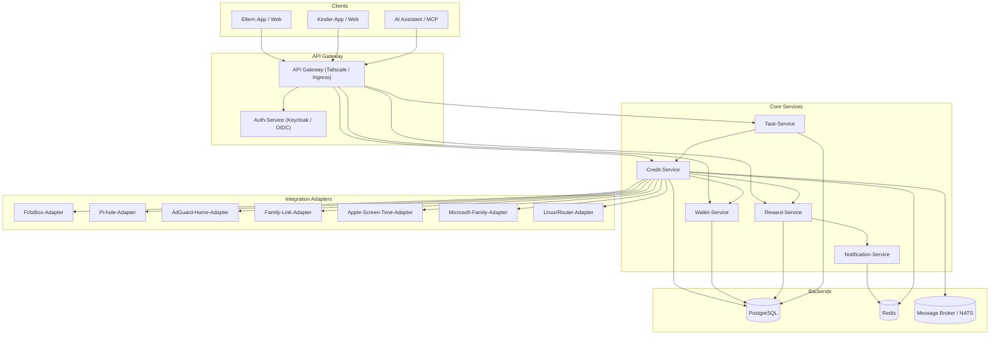

### Kurzbeschreibung der Services

| Service | Verantwortung |
|---------|---------------|
| **Auth-Service** | OIDC-basierte Eltern-/Kinder-Accounts, Gerätezuordnung, OAuth2-Token |
| **Wallet-Service** | Salden, Währungen, Transaktionshistorie, Guthaben-Reservierungen |
| **Credit-Service** | Kerngeschäftslogik: Guthaben vergeben, einlösen, pausieren, verfallen lassen |
| **Reward-Service** | Belohnungskatalog, Bonus-Regeln, Erledigungsnachweise |
| **Task-Service** | Aufgabenlisten, die in Guthaben umgewandelt werden können |
| **Notification-Service** | WhatsApp, E-Mail, Push — Code-Versand, Erinnerungen, Limits |
| **Integration Adapters** | Adapter für konkrete Systeme (FritzBox, Pi-hole etc.) |

---

## 3. Architekturvergleich

| Kriterium | Monolith | Microservices | Event-Driven | Serverless |
|-----------|----------|---------------|--------------|------------|
| **Komplexität** | niedrig | mittel | hoch | mittel |
| **Deploybarkeit** | einfach | unabhängig | unabhängig | vollständig verwaltet |
| **Skalierbarkeit** | vertikal | horizontal | horizontal | automatisch |
| **Wartbarkeit** | bei kleinem Team gut | bei wachsendem Team gut | hoch (Observability) | gut, Vendor-Lock-in |
| **Echtzeitfähigkeit** | gut | gut | sehr gut | gut |
| **Tailscale-tauglich** | ja | ja | ja | eingeschränkt |
| **Empfehlung** | Prototyp/MVP | **Zielarchitektur** | Erweiterung für Echtzeit | Nicht primär |

**Empfehlung:** Microservices auf K3s/QNAP mit event-gesteuerten Ergänzungen (z. B. Kafka/NATS für Limit-Alarme, Einlösungen).

---

## 4. Auth-Flow (OAuth2/OIDC)

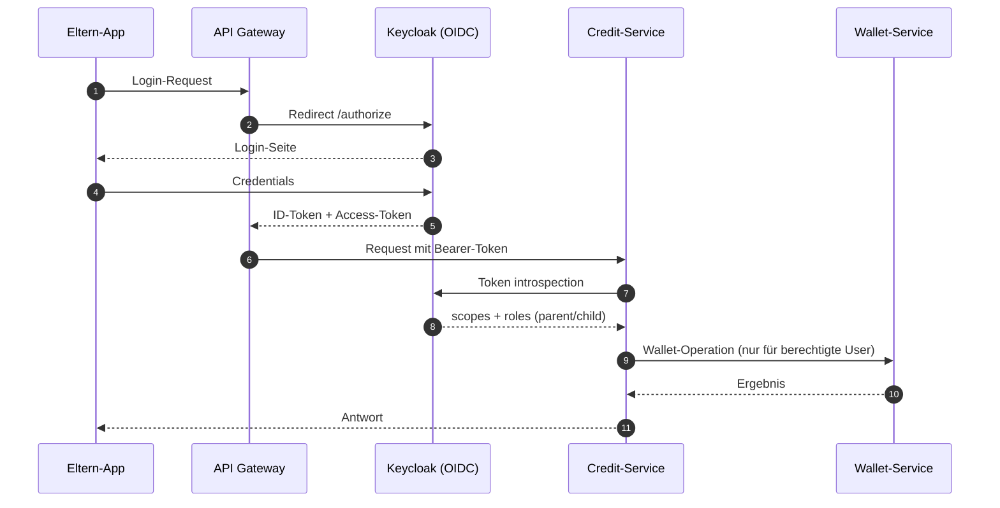

---

## 5. Integrationsdiagramme

### 5.1 FRITZ!Box Zeitkontrolle

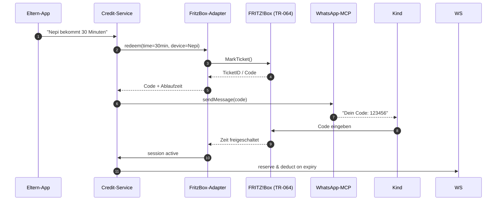

### 5.2 Pi-hole

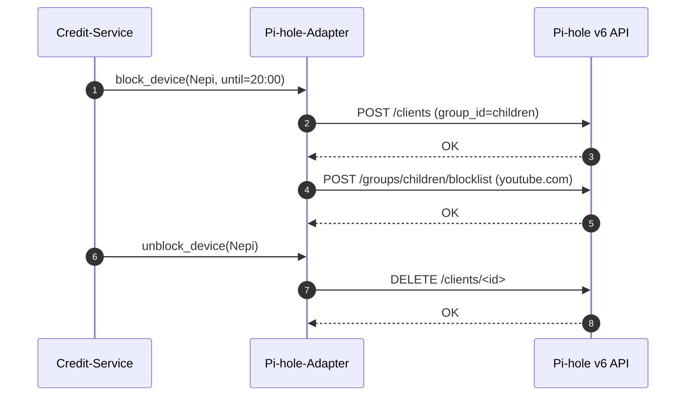

### 5.3 AdGuard Home

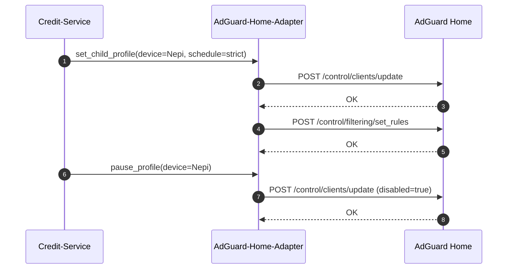

### 5.4 Google Family Link

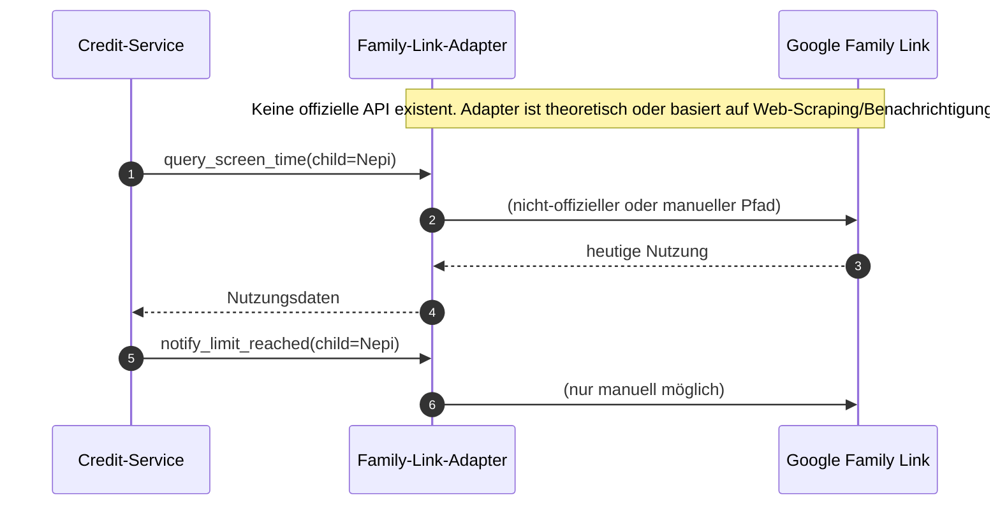

### 5.5 Apple Screen Time / Family Sharing

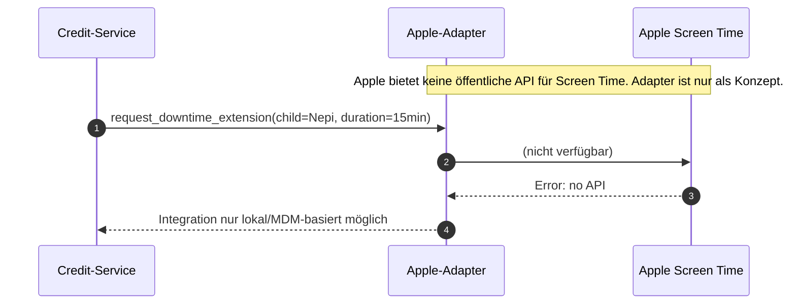

### 5.6 Microsoft Family Safety

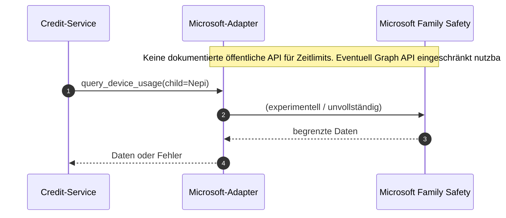

### 5.7 Linux / Router-basierte Lösungen

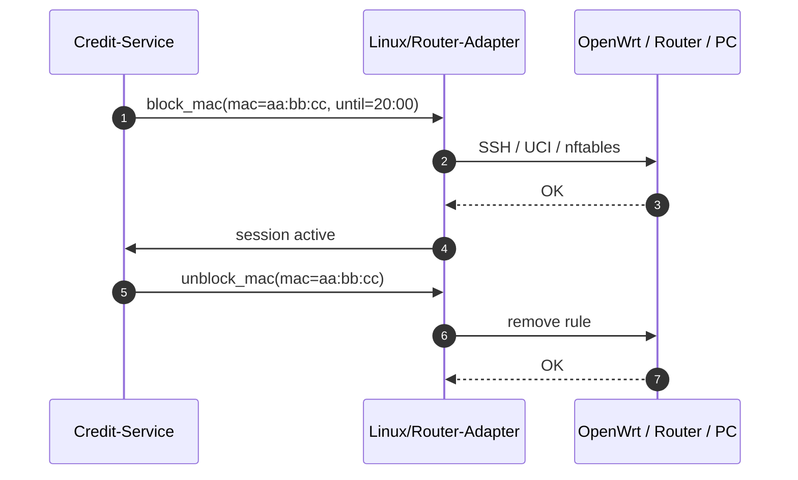

**Mögliche Linux-/Router-Lösungen:**

- **OpenWrt** mit `parental-controls`, `timecontrol`, `nftables`
- **Qustodio** (kommerziell, Cross-Platform)
- **KDE Plasma Mobile Parental Controls**
- **GNOME Settings** → Kindersicherung (eingeschränkt)
- **Mandriva Parental Controls** (historisch)
- **Custom Linux PC-Agent** (zeitgesteuertes Lockscreen/Logout)

---

## 6. Credit-/Token-Fluss mit Bonus

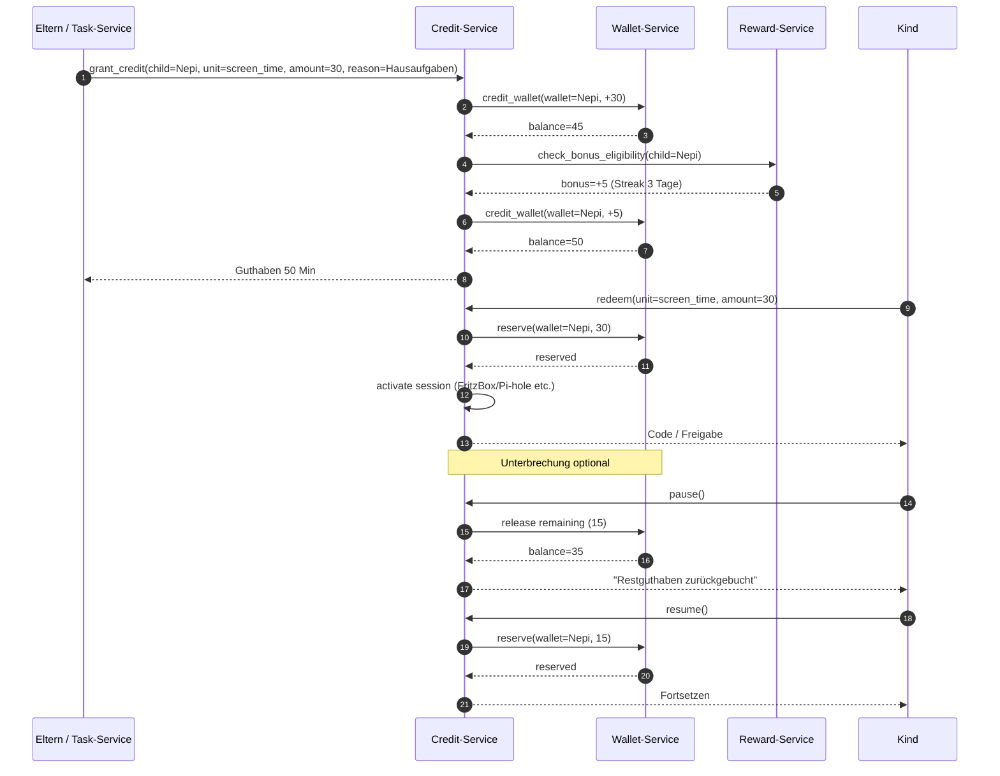

---

## 7. Datenmodell

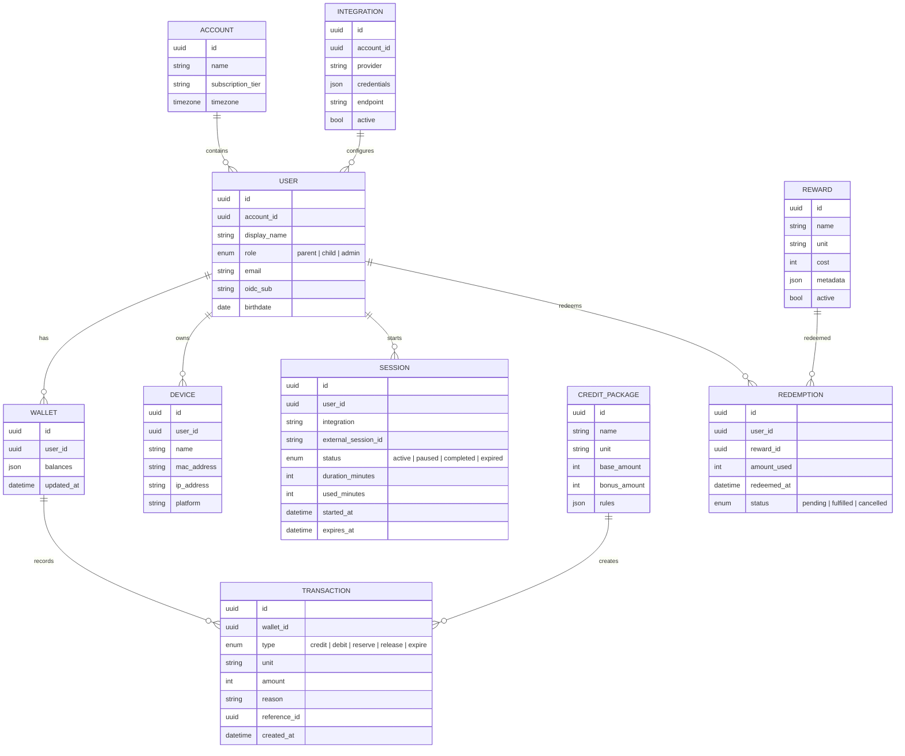

---

## 8. API-Entwurf

### 8.1 Wallets

```
GET    /api/v1/wallets/{user_id}
POST   /api/v1/wallets/{user_id}/credit
POST   /api/v1/wallets/{user_id}/debit
POST   /api/v1/wallets/{user_id}/reserve
POST   /api/v1/wallets/{user_id}/release
GET    /api/v1/wallets/{user_id}/transactions
```

### 8.2 Credits

```
POST   /api/v1/credits/grant
POST   /api/v1/credits/redeem
POST   /api/v1/credits/pause
POST   /api/v1/credits/resume
POST   /api/v1/credits/cancel
GET    /api/v1/credits/sessions
```

### 8.3 Rewards

```
GET    /api/v1/rewards
POST   /api/v1/rewards
POST   /api/v1/rewards/{id}/redeem
GET    /api/v1/rewards/redemptions
```

### 8.4 Tasks

```
GET    /api/v1/tasks
POST   /api/v1/tasks
POST   /api/v1/tasks/{id}/complete
```

### 8.5 Integrations

```
GET    /api/v1/integrations
POST   /api/v1/integrations
PUT    /api/v1/integrations/{id}
DELETE /api/v1/integrations/{id}
POST   /api/v1/integrations/{id}/test
```

---

## 9. Technologie-Vorschläge

| Schicht | Vorschlag | Begründung |
|---------|-----------|------------|
| API-Backend | Python / FastAPI | Moderne, schnelle, OpenAPI |
| Datenbank | PostgreSQL | ACID, JSON-Felder, gut skalierbar |
| Cache | Redis | Sessions, Reservierungen, Rate-Limits |
| Task-Queue | Celery + Redis | Hintergrundjobs, Ablaufzeit, Erinnerungen |
| Message Broker | NATS | Leichtgewichtig, K3s-freundlich |
| Auth | Keycloak | OIDC, OAuth2, Social Logins |
| Netzwerk | Tailscale | Sicherer Zugriff ohne öffentliche Ports |
| Orchestration | K3s (qnap-k3s) | Leichtgewichtiges Kubernetes |
| Monitoring | Prometheus + Grafana | Observability für Microservices |

---

## 10. Referenzen & Inspiration

| Projekt | URL | Relevanz |
|---------|-----|----------|
| BlessedCow/TokenEconomy | <https://github.com/BlessedCow/TokenEconomy> | Einfache Münz-/Belohnungslogik |
| thim81/kids-screen-time | <https://github.com/thim81/kids-screen-time> | Kinder-UI, Quota, Rewards |
| EthanOrr930/PiHoleMCP | <https://github.com/EthanOrr930/PiHoleMCP> | Pi-hole v6 MCP-Adapter |
| fcannizzaro/mcp-adguard-home | <https://github.com/fcannizzaro/mcp-adguard-home> | AdGuard Home MCP-Adapter |
| vahidkaargar/laravel-wallet | <https://github.com/vahidkaargar/laravel-wallet> | Generisches Wallet-Pattern |
| mohamedkaram400/rewards-system | <https://github.com/mohamedkaram400/rewards-system> | Credit-Packages + Redemption |

---

## 11. Offene Punkte & Risiken

| Thema | Status | Risiko |
|-------|--------|--------|
| Google Family Link API | ❌ Nicht öffentlich | Keine direkte Steuerung möglich |
| Apple Screen Time API | ❌ Nicht öffentlich | Nur MDM oder lokale Workarounds |
| Microsoft Family Safety API | ⚠️ Experimentell | Wenig dokumentiert, instabil |
| FRITZ!Box TR-064 | ✅ Verfügbar | Stabile Basis für Zeitkontrolle |
| Pi-hole v6 API | ✅ Verfügbar | Sehr flexibel für DNS-Blocking |
| AdGuard Home API | ✅ Verfügbar | Gute REST-API |
| Linux PC-Steuerung | ⚠️ Eigenbau | Plattformabhängig |
| Unterbrechung/Restzeit | ⚠️ Konzept | Muss je nach Integration definiert werden |

---

## 12. Nächste Schritte

1. **MVP-Scope festlegen**: Zeitguthaben + FRITZ!Box + WhatsApp-Benachrichtigung.
2. **Credit-Service prototypen**: Wallet, Transaction, Session.
3. **FritzBox-Adapter finalisieren**: `MarkTicket`, `GetTicketIDStatus`, automatische Session-Erfassung.
4. **Pi-hole-Adapter bauen**: Block/Unblock per Gerät.
5. **Eltern-UI**: Guthaben vergeben, Rewards konfigurieren, Sessions überwachen.
6. **Kinder-UI**: Guthaben einsehen, Code einlösen, Aufgaben erledigen.
7. **Integrationen mit fehlenden APIs** nur als Dokumentation/Platzhalter behandeln, bis sich APIs ändern.

---

*Letzte Aktualisierung: 2026-07-16*
